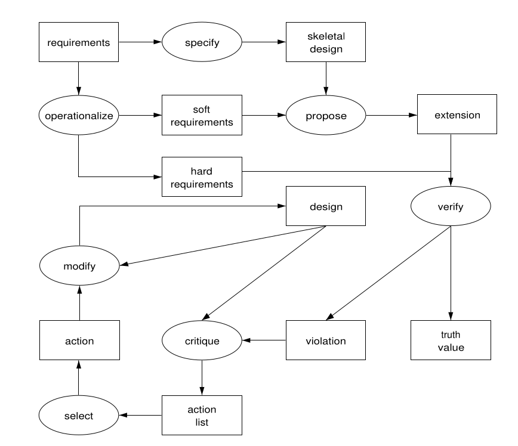
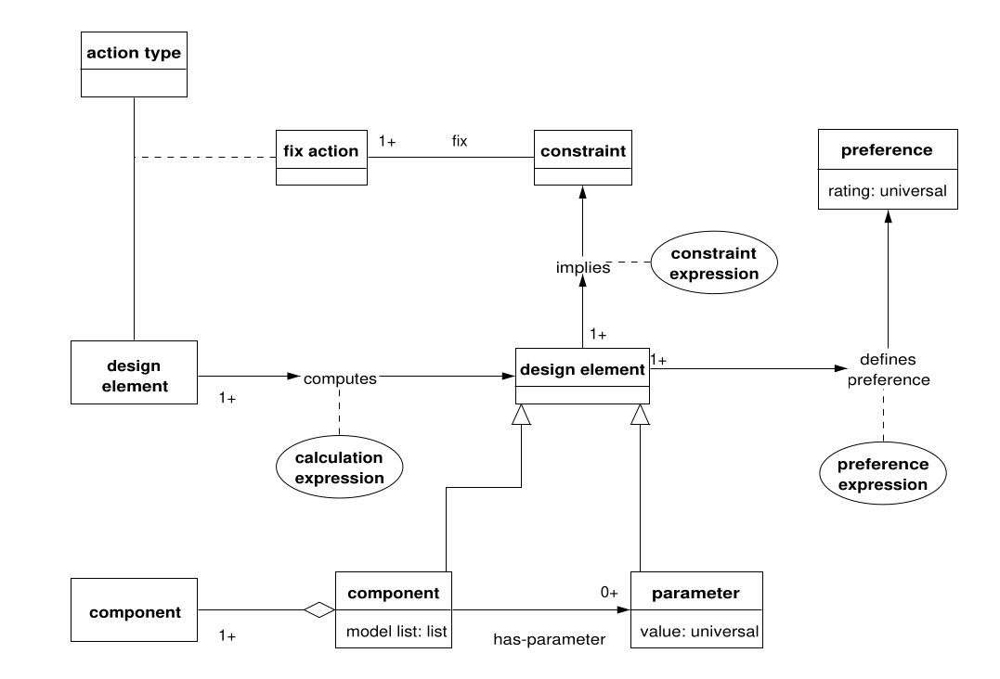

# Traducción de Configuración Diseño
## Caracterización general
* **Objetivo (Goal):** dado un conjunto de componentes predefinidos, encontrar un conjunto de componentes que satisfaga los requisitos y obedezca las restricciones.

* **Ejemplo típico:** Configuración de un ascensor. Configuración de un sistema informático.

* **Terminologías:**
    * **Componente (Component):** una parte del ensamblaje, por ejemplo, la cabina de un ascensor, el disco duro de una computadora.
    * **Parámetro (Parameter):** una característica de un componente (p. ej., la capacidad de almacenamiento de un disco duro) o de un conjunto de componentes (p. ej., el precio total de un sistema informático).
    * **Restricción (Constraint):** define una restricción en la elección de un determinado componente (p. ej., "la placa de la CPU x no puede contener más de y Mb de memoria interna") o el valor de un determinado parámetro ("la carga máxima del cable de elevación es z").
    * **Preferencia (Preference):** permite la elección de un diseño particular en un espacio de diseños válidos. Los problemas de diseño suelen ser abiertos y tienen muchas soluciones "correctas". Las preferencias se utilizan para indicar el diseño más deseado. Por ejemplo, minimizar el precio es una preferencia frecuente. Las preferencias se pueden ordenar en una escala ordinal.
    * Requisito (Requirement): necesidades y deseos de los futuros usuarios del sistema a configurar, por ejemplo, el precio total, la velocidad. Los requisitos generalmente se traducen en restricciones ("hard requirement") o preferencias ("soft requirement").
* **Entrada (Input):** Un conjunto de requisitos.
* **Salida (Outout):** un ensamblaje que consta de componentes y valores de parámetros instanciados.
* **Características (Features):** El diseño de configuración es una forma de diseño que se adapta bien a la automatización. Sin embargo, computacionalmente, la tarea suele ser mucho más exigente que las tareas de análisis.

## Método predeterminado (Default method)
Existe una gran cantidad de literatura sobre métodos de diseño de configuración. Hemos seleccionado una variación de la clase de métodos proponer-criticar-modificar descritos por Chandrasekaran (1990). La especificación del método conceptual se muestra en el ejemplo del código abajo. La estructura básica del método es:

1. Proponer una extensión de diseño.
2. Verificar el diseño actual; si el diseño extendido está bien, continúe con el paso 1; de lo contrario, vaya al paso 3.
3. Criticar el diseño actual y generar una lista ordenada de acciones para revisar el diseño actual.
4. Seleccione una acción y modifique el diseño en consecuencia hasta que la función de verificación tenga éxito.
5. Regrese al paso 1. Si no hay más extensiones disponibles, informe la configuración encontrada.

```
TASK configuración-diseño;
    ROLES:
    INPUT: requisitos: "requisitos para el diseño";
    OUTPUT: diseño: "el diseño resultante";
END TASK configuración-diseño;

TASK-METHOD proponer-y-revisar;
    REALIZES: configuración-diseño;
    DECOMPOSITION:
        INFERENCES: operacionalizar, especificar, proponer, verificar, criticar, seleccionar, modificar;
    ROLES:
        INTERMEDIATE:
            soft-requirements: "requisitos que se utilizarán como preferencias";
            hard-requirements: "requisitos que son restricciones estrictas";
            skeletal-design: "conjunto de elementos de diseño";
            extensiOn: "un único valor nuevo para un elemento de diseño";
            violation: "restricción violada por el diseño actual";
            truth-value: "booleano que indica el resultado de la verificación";
            action-list: "lista ordenada de posibles acciones de reparación (fijación)";
            action: "una sola acción de reparación";
    
    CONTROL-STRUCTURE:
        operacionalizar (requirements -> hard-requirements + soft-requirements);
        especificar (requirements -> skeletal-design);
        WHILE NEW-SOLUTION propuesta (skeletal-design + design + soft-requirements -> extension) DO
            diseño := extensión AGREGAR diseno;
            verificar (diseño + hard-requirements -> truth-value + violation);
            IF truth-value == false ENTONCES
               crítica (violación + diseño -> lista de acciones);
                REPETIR
                    seleccionar (lista de acciones -> acción);
                    modificar (diseño + acción -> diseño);
                    verificar (diseño + hard-requirements -> truth-value + violación);
                HASTA truth-value == true;
                FIN DE REPETIR
            END IF
        END WHILE
END TASK-METHOD proponer-y-revisar;
```

* **Operacionalizar los requisitos:** Las necesidades y los deseos del usuario deben traducirse en restricciones y preferencias operativas en las que el método pueda trabajar. Por ejemplo, el requisito “suave” del sistema rápido se traduce en la preferencia “maximizar el parámetro “velocidad” del componente “procesador”. Esta operacionalización no siempre es trivial, y puede requerirse una obtención de conocimiento extensa.

* **Especificar el diseño esquelético:** Un diseño esquelético es un formato predefinido para el diseño: ¿qué colección típica de componentes debería contener la solución? En muchos problemas simples de configuración y diseño, solo hay una estructura de artefacto básica fija con algunos componentes opcionales. La configuración de un sistema de computadora personal es un ejemplo de esto. En este caso, esta función es simplemente una búsqueda del diseño esquelético predeterminado. En aplicaciones más complejas, existen varios diseños esqueléticos, uno de los cuales debe seleccionarse.

* **Proponer extensión de diseño:** Esta función suele ser una tarea en sí misma con al menos dos inferencias alternativas para proponer una extensión de diseño:

    1. Calcule una extensión de diseño, dadas las opciones de componentes en el diseño actual. Los valores de los parámetros suelen depender lógicamente del tipo de componente seleccionado. Por ejemplo, un determinado procesador tiene un determinado precio y velocidad. Para los valores calculados, es útil mantener un registro de los valores de los que depende este cálculo. Esto se puede utilizar en la función de modificación más adelante.
    2. Prefiera una extensión de diseño usando las preferencias en la base de conocimientos y las preferencias del usuario para seleccionar un componente o valor de parámetro en el diseño esquelético que aún no se ha instanciado. Si existe una escala ordinal de preferencias, utilícela en la selección. Nuevamente, es útil mantener un registro de las preferencias utilizadas para seleccionar un valor para un componente.

    El enfoque sencillo es tratar de encontrar primero una extensión calculada, antes de que se invoque la inferencia de preferencia.

* **Verificar la configuración actual:** Verifique con la ayuda de las restricciones internas y las proporcionadas por el usuario si la configuración actual es internamente consistente. Si la verificación falla, genere la restricción violada como una salida adicional.
* **Criticar el diseño actual:** Una forma simple pero efectiva de criticar es incluir conocimiento del dominio que asocie una restricción con "arreglos": acciones que se pueden emprender para modificar el diseño de modo que desaparezca la violación. Por ejemplo, una violación de la restricción "capacidad mínima de almacenamiento" se puede corregir con la acción "actualizar disco duro". Estas correcciones suelen sugerir una lista ordenada de posibles acciones. En casos más complejos, la solución puede implicar actualizaciones de más de un valor de diseño. Como regla general, solo los elementos de diseño para los que se ha "preferido" un valor pueden ser objeto de fijación.
* **Seleccionar una acción:** Suele ser una simple selección del primer elemento no probado de la lista de acciones generada por la función de crítica.
* **Modificar la configuración:** Esta función aplica la acción de corrección al diseño. La función también elimina todos los componentes cuyo valor dependía del elemento modificado e invoca el cálculo de inferencia para volver a calcular nuevos valores.



## Variaciones del método
 Se deben considerar dos variaciones importantes:
 
 1. _Realice la verificación más la revisión solo cuando se haya propuesto un valor para todos los elementos de diseño_. Este cambio requiere, de hecho, solo un simple ajuste de la estructura de control del método, pero puede tener un gran impacto en la competencia del método. Consultar a Motta et al. (1996) para una discusión detallada de este tema.
 2. _Evite el uso de conocimientos fijos_. Las correcciones se pueden ver como heurísticas de búsqueda para guiar el espacio potencialmente extenso de diseños alternativos una vez que se viola una restricción. Sin embargo, podría resultar que las correcciones no estén disponibles en la aplicación o solo sean fragmentarias. En ese caso, el ingeniero del conocimiento tendrá que recurrir a una técnica como el retroceso cronológico para realizar el proceso de revisión. Esta solución suele ser computacionalmente mucho más exigente.

 ## Esquema de dominio típico 

 
 La Figura anterior muestra los principales tipos de conocimiento de dominio involucrados en el diseño de configuración utilizando el método predeterminado. El concepto central es elemento de diseño. Este es un supertipo de componente y parámetro. Los parámetros están vinculados a un determinado componente. Los propios componentes también actúan como una especie de parámetro: su "valor" es el "modelo" seleccionado para el componente. Por ejemplo, para un componente de disco duro podemos seleccionar varios modelos, cada uno con sus propios valores de parámetros (para capacidad, tipo de acceso, precio, etc.). De hecho, el método de proponer y revisar trata los componentes de manera similar a los parámetros. Los componentes se pueden organizar en una estructura de componentes agregados a través de una relación de agregación (ver la parte inferior izquierda de la Figura anterior).

 El esquema de dominio contiene tres tipos de reglas. La expresión de cálculo de tipo de regla describe piezas de conocimiento que representan dependencias computacionales entre elementos de diseño. Un ejemplo es el parámetro de peso de un componente agregado que se puede derivar de los pesos combinados de sus subcomponentes. La expresión de restricción de tipo de regla describe las restricciones en los elementos de diseño. El antecedente consta de una o más expresiones lógicas sobre elementos de diseño. Si el antecedente se evalúa como verdadero, se asume que la construcción es verdadera. La conclusión de la regla es una expresión sobre alguna etiqueta de restricción, por ejemplo, que se ha excedido la restricción "capacidad mínima de almacenamiento". Finalmente, el tipo de regla preferencia-expresión define una dependencia entre un elemento de diseño y una preferencia. Un ejemplo sería la preferencia “Intel inside” que requiere como antecedente que el parametrizador del componente procesador tenga el valor “Intel”. Las preferencias están asociadas con una calificación de preferencia, lo que indica la importancia relativa de las preferencias. La representación exacta de la calificación de preferencia es específica de la aplicación.

 